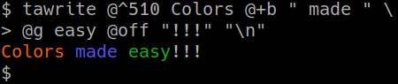
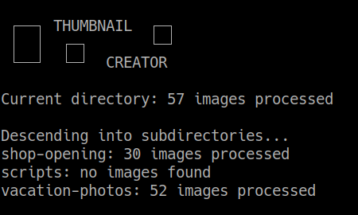
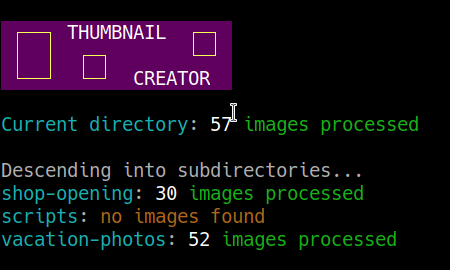
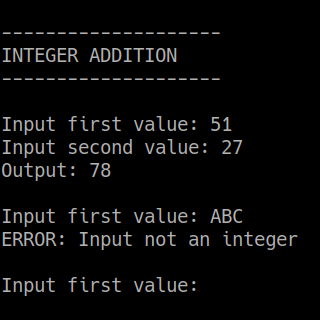
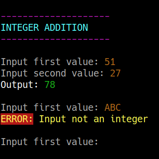

# textattr

**textattr** is a library and command-line tool that makes adding color and attributes to beautify the terminal output of your program easier by translating human-readable specs into ANSI escape codes.

## Rationale

Terminal input/output for applications is still relevant for a wide variety of reasons. The readability and attractiveness of these applications can be vastly improved by the judicious use of colors and other attributes. This is exactly just like how syntax highlighting helps with the readability of different kinds of text files.

Both non-interactive and interactive terminal applications can benefit from this.

Consider a non-interactive script which descends a file tree and creates thumbnails with some preset size etc:

 

Or an interactive calculator program:

 

It should be evident that colors (and attributes) are very useful to beautify the text!

## Syntax

**textattr** takes as input whitespace-separated specs denoting the required colors and/or attributes.

The actual specs cannot be easily described in this plaintext README document. You can open the [help in HTML format](docs/help.html) in a browser to get an idea, but due to the varying support for text attributes among terminal emulators, the only way to know how these are going to be displayed in a particular terminal environment is to invoke the executable `ta-help` from therein.

## Usage from the command-line or in shell scripts

**textattr** is to be normally invoked as `ta` to output the escape codes for an input spec string. This makes it easy to use command substitution to include the escape codes in the output of `echo` or such.

Another invocation is `tawrite` which treats arguments given to it and starting with `@` as spec strings, which may be useful to avoid multiple `$()` instances.

The environment variable `TA_DISABLED` may be `export`-ed by you or the users of your script to (temporarily) disable the production of escape codes.

**textattr** may also be invoked as `ta-code` to give a C-style escaped representation of the escape code for use elsewhere. This is not affected by `TA_DISABLED`.

## Usage from other programming languages

Here, **textattr** may be invoked as `ta` or as `tawrite` with the same behavior as above. `tawrite` is probably the more useful option in programming languages than in shell scripts.

There is also the global variable `taDisabled` defaulting to `false`.

In a C/C++ program, **textattr** can be called a maximum of 40 times before it reuses its internal buffers, so care should be taken to copy the output to a terminal or another buffer before then.

In C++, to fit in with the stream idiom, instead of `tawrite` there are `ta_cout` and `ta_cerr` which act as **textattr**-enabled versions of `cout` and `cerr`.

In Python, note that `taDisabled` is a function taking a boolean and not a variable.

Currently **textattr** is available as a library for C, C++, D and Python. Contributions of wrappers (or translations if really necessary) to other languages are welcome.

## Usage examples and demos

For basic usage, look under the `examples` directory. For a more detailed treatment, look under the `demos` directory. Copious comments are provided in these files.

## Utilities

**textattr** comes with some useful filters:

1. **ta-rm** removes escape codes from text

2. **ta-show** reveals escape codes in text

3. **ta2html** converts text with escape codes to HTML

**ta-rm** and **ta-show** do not take any arguments. **ta2html** also does not need any arguments for basic usage, but you can run it standalone to know more about some options it provides.

## Building and installing

**textattr** does not depend on any libraries other than the languages' standard libraries.

Thus after downloading the repo tarball or cloning the repo, for building and installing you just need to run `sudo make install` from the repo root.

However, you need to specify the correct locations for Python 2 and 3 to install the Python wrapper in, and the D compiler that you are using (since the command-line syntax varies). So you will need to do something like:

`sudo  PYTHON2_LIB_DIR=/usr/lib/python2.7/dist-packages/ PYTHON3_LIB_DIR=/usr/lib/python3/dist-packages/ DLANG_COMPILER=dmd  make install`

## Copyright and license

**textattr** is copyrighted in 2018 by [Shriramana Sharma](mailto:samjnaa-at-gmail-dot-com), India, and provided for free/libre use under a "BSD-2-Clause"-type license as stated in the accompanying file [LICENSE.txt](LICENSE.txt). This is in gratitude to all the great software I have been using all these years!

**textattr** was first released (after some years of remaining within my own systems) in 2018 on the occasion of Dipavali or Diwali, the Indian festival of colors and light!
